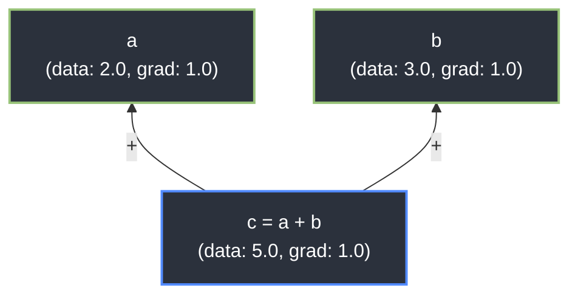

# Principia 🍎

<p align="center">
    
    
    
</p>

A lightweight automatic differentiation engine and Radial Basis Function Kolmogorov-Arnold Network (RBF-KAN) implementation built from scratch in pure Python and NumPy.

Principia explores gradient-based learning through two implementations: a custom scalar-level autograd system in `engine/v1` and a NumPy-backed tensor engine in `engine/tensor.py`. Instead of relying on high-level frameworks like PyTorch, the project constructs Directed Acyclic Graphs (DAGs) on the fly to track mathematical operations and applies reverse-mode differentiation via topological sorting.

---

## ⚡ The Autograd Engine: `Value`

At the core of Principia is the `Value` class, which wraps standard Python scalars to record their operational history. 

### API at a Glance
The API is designed to be intuitive and mimic standard tensor operations:

```python
from engine.v1.value import Value

# Initialize scalars with gradients
a = Value(2.0)
b = Value(3.0)

# Build the computation graph
c = (a ** 2) / b

# Execute reverse-mode autodiff
c.backward()

print(f"Gradient of a (dc/da): {a.gradient}") # Outputs: 1.333...
print(f"Gradient of b (dc/db): {b.gradient}") # Outputs: -0.444...
```

### How it Works
1. **The Forward Pass:** Every overloaded mathematical operation (`+`, `*`, `**`, `exp`) calculates the raw math, instantiates a new `Value` node, links the inputs as children, and stores a localized closure containing the exact chain-rule calculus for that specific operation.
2. **The Backward Pass:** When `.backward()` is called, the engine runs a Depth-First Search (DFS) to build a topological sort of the graph. It then iterates in reverse, triggering the localized closures to cascade gradients perfectly down the DAG.



---

## 🧠 Kolmogorov-Arnold Networks (KAN)

Using the custom autograd engine, Principia implements an RBF-KAN architecture, replacing standard MLP linear transformations with learnable Gaussian Radial Basis Functions.

### RBF Edge Mathematics
Each edge in the network computes a parameterized Gaussian function:

$$\phi(x) = w \cdot e^{-\gamma (x - \mu)^2}$$

Where the autograd engine independently tracks and updates the gradients for:
* **$w$** (`amplitude`): The height of the curve.
* **$\gamma$** (`width`): The spread of the curve.
* **$\mu$** (`mean`): The center position of the curve.

### Interactive Demonstration

<p align="center">
  
</p>

---

## 🚀 Quickstart

### Installation
Principia uses a minimal dependency set.

```bash
# Clone the repository
git clone https://github.com/KodingOnion/principia.git
cd principia
python -m pip install numpy
```

### Running the Engine
Execute the interactive gradient descent demonstration:
```bash
python demos/v1/demo_autograd.py
```

### Running the Test Suite
Principia is built with rigorous engineering standards. You can verify the engine's mathematical accuracy (including multivariable chain-rule accumulation) by running the native unit tests:
```bash
python -m unittest discover -s tests
```

---

## ⏳ TODO

### Add tensors extend Value class
This allows for large performance improvements by calculating gradients at once rather than iterating through the entire network many times for each training loop.

### Add multithreading in python (async)
Improves performance by allowing processor to run multiple calculations at once, greatly increasing performance.

---

## 📂 Architecture Overview

```
principia/
├── __init__.py             # Package initialization
├── main.py                 # Entry point placeholder
├── engine/                 # Core tensor/autograd + KAN components
│   ├── tensor.py
│   ├── module.py
│   ├── linear.py
│   ├── KANLayer.py
│   ├── KAN.py
│   └── v1/                 # Scalar autograd implementation and legacy KAN stack
├── demos/                  # Interactive demos
│   ├── linear_network.py
│   ├── sin_network.py
│   └── v1/
├── tests/                  # Unit tests for tensor engine and v1 modules
│   ├── test_tensor.py
│   ├── test_nn.py
│   └── v1/
└── assets/                 # Project assets and media
```
