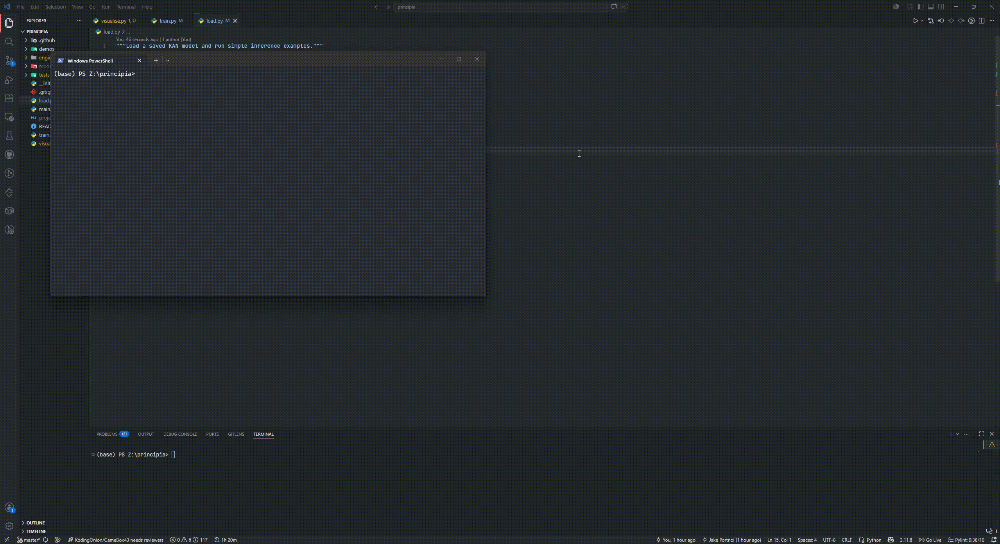

# Principia 🍎

<p align="center">
  
  
  
</p>

Principia is a lightweight neural-network playground built from scratch in Python. It includes:

- A NumPy-backed `Tensor` class with reverse-mode autodiff
- A minimal module system (`Module`, `Linear`, `KANLayer`, `KAN`)
- Adam optimization and MSE loss
- Demo scripts for linear regression and sine approximation
- A legacy scalar autograd implementation under `engine/v1`

## Demo

<p align="center">
  
</p>

## Project Structure

```text
principia/
├── engine/
│   ├── tensor.py         # Core Tensor + autodiff engine
│   ├── module.py         # Base Module class and gradient reset
│   ├── linear.py         # Linear layer
│   ├── KANLayer.py       # RBF-based KAN layer
│   ├── KAN.py            # Multi-layer KAN wrapper
│   ├── adam_optim.py     # Adam optimizer
│   ├── mse.py            # Mean squared error loss
│   └── v1/               # Legacy scalar autograd implementation
├── demos/
│   ├── linear_network.py # Linear model training demo
│   ├── sin_network.py    # KAN sine approximation demo
│   └── v1/demo_autograd.py
├── tests/
│   ├── test_tensor.py
│   ├── test_nn.py
│   └── v1/
└── assets/
    └── demo.gif
```

## Quickstart

### 1) Clone

```bash
git clone https://github.com/KodingOnion/principia.git
cd principia
```

### 2) Install dependency

```bash
python -m pip install numpy
```

> `demos/sin_network.py` also uses `matplotlib` for plotting.

### 3) Run demos

```bash
python demos/linear_network.py
python demos/sin_network.py
python demos/v1/demo_autograd.py
```

## Run Tests

From the repository root:

```bash
python -m unittest discover -s tests
```

## Notes

- The modern engine is in `engine/tensor.py` and is used by current NN components.
- The `engine/v1` package is kept for the original scalar `Value`-based experiments and demos.
