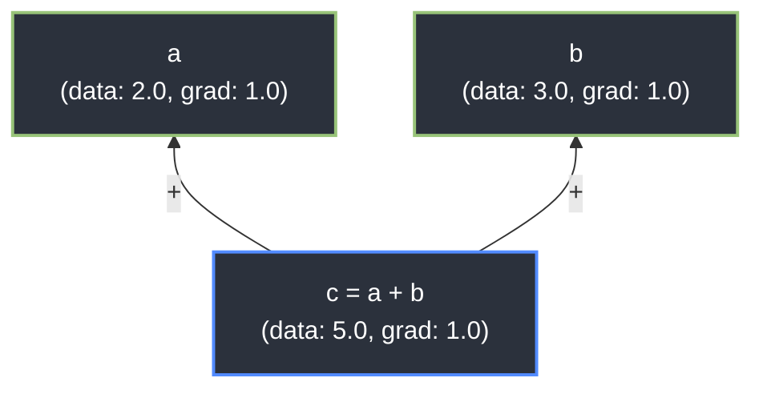

# Principia 🍎


A lightweight, **zero-dependency** automatic differentiation engine and Radial Basis Function Kolmogorov-Arnold Network (RBF-KAN) implementation built from scratch in pure Python.

Principia explores gradient-based learning by implementing a custom scalar-level autograd system. Instead of relying on external tensor libraries like PyTorch or NumPy, this engine constructs Directed Acyclic Graphs (DAGs) on the fly to track mathematical operations and applies reverse-mode differentiation via topological sorting.

---

## ⚡ The Autograd Engine: `Value`

At the core of Principia is the `Value` class, which wraps standard Python scalars to record their operational history. 

### API at a Glance
The API is designed to be intuitive and mimic standard tensor operations:

```python
from engine.value import Value

# Initialize scalars with gradients
a = Value(2.0)
b = Value(3.0)

# Build the computation graph
c = (a ** 2) / b

# Execute reverse-mode autodiff
c.backward()

print(f"Gradient of a (dc/da): {a.gradient}") # Outputs: 1.333...
print(f"Gradient of b (dc/db): {b.gradient}") # Outputs: -0.444...
```

### How it Works
1. **The Forward Pass:** Every overloaded mathematical operation (`+`, `*`, `**`, `exp`) calculates the raw math, instantiates a new `Value` node, links the inputs as children, and stores a localized closure containing the exact chain-rule calculus for that specific operation.
2. **The Backward Pass:** When `.backward()` is called, the engine runs a Depth-First Search (DFS) to build a topological sort of the graph. It then iterates in reverse, triggering the localized closures to cascade gradients perfectly down the DAG.



---

## 🧠 Kolmogorov-Arnold Networks (KAN)

Using the custom autograd engine, Principia implements an RBF-KAN architecture, replacing standard MLP linear transformations with learnable Gaussian Radial Basis Functions.

### RBF Edge Mathematics
Each edge in the network computes a parameterized Gaussian function:

$$\phi(x) = w \cdot e^{-\gamma (x - \mu)^2}$$

Where the autograd engine independently tracks and updates the gradients for:
* **$w$** (`amplitude`): The height of the curve.
* **$\gamma$** (`width`): The spread of the curve.
* **$\mu$** (`mean`): The center position of the curve.

### Interactive Demonstration

<p align="center">
  
</p>

---

## 🚀 Quickstart

### Installation
Because Principia is entirely dependency-free, no virtual environment or `pip install` is required.

```bash
# Clone the repository
git clone [https://github.com/YourUsername/principia.git](https://github.com/YourUsername/principia.git)
cd principia
```

### Running the Engine
Execute the interactive gradient descent demonstration:
```bash
python demos/demo_autograd.py
```

### Running the Test Suite
Principia is built with rigorous engineering standards. You can verify the engine's mathematical accuracy (including multivariable chain-rule accumulation) by running the native unit tests:
```bash
python -m unittest discover -s tests
```

---

## 📂 Architecture Overview

```
principia/
├── __init__.py              # Package initialization
├── main.py                  # Main entry point
├── load.py                  # Model loading utilities
├── train.py                 # Training script
├── visualise.py             # Visualization utilities
├── project.md               # Project documentation
│
├── engine/                  # Core autograd and network implementation
│   ├── value.py            # Scalar autograd node and reverse-mode differentiation
│   ├── rbf_edge.py         # Gaussian RBF edge parameterization
│   ├── layer.py            # Edge-matrix layer behavior and parameter flattening
│   ├── model.py            # Network construction, forward cascade, JSON serialization
│   └── optim.py            # Optimization algorithms
│
├── demos/                   # Interactive demonstrations
│   └── demo_autograd.py    # Interactive CLI gradient descent demo
│
├── tests/                   # Comprehensive mathematical unit tests
│   ├── __init__.py
│   ├── test_value.py       # Autograd engine tests
│   ├── test_rbf_edge.py    # RBF edge parameterization tests
│   ├── test_layer.py       # Layer behavior tests
│   ├── test_model.py       # Model construction tests
│   └── test_optim.py       # Optimization algorithm tests
│
├── models/                  # Trained model checkpoints
│   └── model_epoch_*.json   # Serialized model states
│
└── assets/                  # Project assets and resources
```